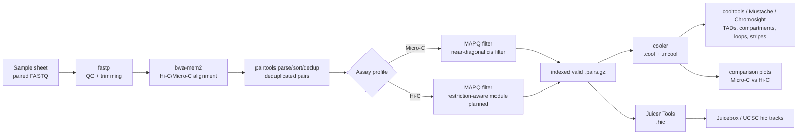

# microc2tracks

`microc2tracks` is a shell-script-first Micro-C / Hi-C workflow for producing common contact matrix outputs and downstream analyses from paired-end FASTQ files.

The first implementation follows the style of the existing Shell repositories `fastq2tracks` and `rnaseq2tracksP`: a top-level runner, `config/`, `docs/`, `examples/`, `scripts/`, `environment.yml`, and simple tests.

## Workflow Schematic



## What It Produces

For each sample:

- trimmed FASTQ files and `fastp` QC
- deduplicated `.pairs.gz` contacts
- MAPQ-filtered valid `.pairs.gz`
- raw and balanced `.cool`
- raw and balanced `.mcool`
- raw and normalized `.hic`
- pairtools stats and MultiQC report

Optional downstream scripts can generate:

- insulation scores and TAD boundary tables
- compartment eigenvectors
- saddle plot inputs
- loop calls with `cooltools` and/or Mustache
- Micro-C vs Hi-C side-by-side matrix plots
- P(s) curve comparison plots

## Functionality Overview

| Area | Current functionality | Main outputs | Status |
|---|---|---|---|
| FASTQ QC and trimming | Paired-end adapter detection and trimming | `fastp.html`, `fastp.json`, trimmed FASTQ | implemented |
| Alignment | Hi-C/Micro-C style chimeric-read alignment with `bwa-mem2 mem -SP5M` | streamed SAM into pairtools | implemented |
| Contact parsing | Parse, sort, deduplicate, and index contact pairs | `.dedup.pairs.gz`, `.valid.mapq*.pairs.gz`, `.px2` | implemented |
| Micro-C filtering | MAPQ filtering plus configurable short cis-distance filter | Micro-C-ready valid pairs | implemented |
| Hi-C support | Shared FASTQ-to-pairs-to-matrices path | Hi-C `.pairs.gz`, `.mcool`, `.hic` | implemented; restriction-fragment filtering planned |
| Matrix generation | Raw and balanced single-resolution and multiresolution matrices | `.cool`, `.mcool` | implemented |
| `.hic` export | Juicer-compatible `.hic` generation and normalization | `.raw.hic`, `.norm.hic` | implemented |
| Replicate merging | Merge filtered pair files and rebuild matrices | merged `.pairs.gz`, `.mcool`, `.hic` | implemented |
| QC aggregation | Collect QC reports where available | MultiQC report | implemented |
| TADs / insulation | Run insulation score and boundary calling from `.mcool` | insulation tables, boundaries | implemented when `cooltools` is installed |
| Compartments / saddle | Expected contacts, eigenvectors, saddle-ready outputs | expected TSV, eigenvectors, saddle inputs | partial; phasing track required |
| Loops | CPU-friendly loop calling | `cooltools dots`, Mustache outputs | implemented when tools are installed |
| Stripes | Stripe detection pathway | Chromosight outputs | planned/optional |
| Micro-C vs Hi-C comparison | Side-by-side matched-resolution matrix plots | PNG plots | implemented |

## Software Stack

| Step | Default software | Link | Notes |
|---|---|---|---|
| Environment management | Conda | [conda](https://docs.conda.io/) | `environment.yml` is conda-first; mamba is optional, not required. |
| FASTQ trimming/QC | fastp | [OpenGene/fastp](https://github.com/OpenGene/fastp) | Fast paired-end QC and adapter trimming. |
| Alignment | bwa-mem2 | [bwa-mem2](https://github.com/bwa-mem2/bwa-mem2) | Uses Hi-C/Micro-C-friendly `-SP5M` flags. |
| Reference indexing | samtools | [samtools](https://www.htslib.org/) | Creates `.fai` and chromosome sizes. |
| Contact parsing/filtering | pairtools | [open2c/pairtools](https://github.com/open2c/pairtools) | Central `.pairs.gz` workflow backbone. |
| Pair indexing | pairix | [4dn-dcic/pairix](https://github.com/4dn-dcic/pairix) | Indexes pairs for random access and cooler loading. |
| Matrix storage | cooler | [open2c/cooler](https://github.com/open2c/cooler) | Creates `.cool` and `.mcool` matrices. |
| `.hic` generation | Juicer Tools | [aidenlab/juicer](https://github.com/aidenlab/juicer) | Produces Juicebox/UCSC-compatible `.hic` files. |
| QC reporting | MultiQC | [MultiQC](https://multiqc.info/) | Aggregates available QC outputs. |
| Insulation/TADs | cooltools | [open2c/cooltools](https://github.com/open2c/cooltools) | Default downstream matrix analysis toolkit. |
| Loop calling | cooltools dots, Mustache | [cooltools](https://github.com/open2c/cooltools), [Mustache](https://github.com/ay-lab/mustache) | CPU-friendly defaults for no/limited GPU servers. |
| Stripes | Chromosight | [Chromosight](https://github.com/koszullab/chromosight) | Optional downstream module. |
| Pileups | coolpuppy | [coolpuppy](https://github.com/open2c/coolpuppy) | Optional aggregate loop/anchor analysis. |
| Format conversion | hictk | [hictk](https://github.com/paulsengroup/hictk) | Optional fast `.hic`/`.cool` toolkit. |
| Alternative downstream suite | HiCExplorer | [HiCExplorer](https://github.com/deeptools/HiCExplorer) | Optional TAD/visualization tools. |

## Recommended Design

Use one unified workflow with assay-specific configuration:

- Micro-C: no restriction fragment logic, default near-diagonal cis filter of 1000 bp.
- Hi-C: shared alignment, pairs, matrix, and downstream path; restriction-enzyme-aware filtering can be added as a focused module when enzyme metadata are available.
- Both assays produce `.pairs.gz`, `.mcool`, and `.hic`, which makes downstream comparison consistent.

## Quick Start

```bash
git clone https://github.com/MichalGd/microc2tracks.git
cd microc2tracks

conda env create -f environment.yml
conda activate microc2tracks

cp config/config_template.conf config/config.conf
cp config/samplesheet_template.csv config/samplesheet.csv

# Edit config/config.conf and config/samplesheet.csv first.
bash scripts/preflight_check.sh -c config/config.conf -s config/samplesheet.csv
bash scripts/microc2tracks.sh -c config/config.conf -s config/samplesheet.csv
```

Optional heavier downstream tools can be installed in a separate environment:

```bash
conda env create -f envs/downstream_optional.yml
```

## Shared Server Environment

For an installation available to all users, create the conda environment at a shared prefix instead of using a user-local named environment:

```bash
sudo mkdir -p /opt
sudo git clone https://github.com/MichalGd/microc2tracks.git /opt/microc2tracks
cd /opt/microc2tracks

source /opt/miniconda3/etc/profile.d/conda.sh

conda env create \
  -p /opt/conda/envs/microc2tracks \
  -f environment.yml

conda activate /opt/conda/envs/microc2tracks
```

Then make the pipeline, environment, references, and Juicer Tools readable/executable:

```bash
sudo chgrp -R bioinfo /opt/microc2tracks /opt/conda/envs/microc2tracks
sudo chmod -R a+rX /opt/microc2tracks /opt/conda/envs/microc2tracks
sudo chmod -R a+rX /shared/references /shared/software/juicer_tools
```

See `docs/02_installation_server.md` for optional `/usr/local/bin` launchers.

For downstream analysis of one matrix:

```bash
bash scripts/run_downstream.sh \
  -c config/config.conf \
  -s microC1 \
  -m results/microC1/04_matrices/microC1.norm.mcool
```

Compare a Micro-C and Hi-C region:

```bash
python scripts/compare_matrices.py \
  --matrix-a results/microC1/04_matrices/microC1.norm.mcool \
  --matrix-b results/hic1/04_matrices/hic1.norm.mcool \
  --label-a Micro-C \
  --label-b Hi-C \
  --resolution 10000 \
  --region chr1:30000000-35000000 \
  --out results/comparison/microc_vs_hic_chr1.png
```

## Main Files

- `config/config_template.conf`: server, reference, tool, and resource defaults
- `config/samplesheet_template.csv`: sample metadata template
- `scripts/microc2tracks.sh`: FASTQ to pairs, `.cool`, `.mcool`, and `.hic`
- `scripts/merge_replicates.sh`: merge filtered pairs and rebuild matrices
- `scripts/run_downstream.sh`: common downstream analyses from `.mcool`
- `scripts/compare_matrices.py`: side-by-side matrix plotting
- `environment.yml`: core upstream matrix environment
- `envs/downstream_optional.yml`: optional heavier downstream tools
- `docs/`: analysis notes, installation, inputs, outputs, and troubleshooting

## Server Fit

The defaults target a shared CPU-heavy server with 500 GB RAM, 70 physical CPU cores, 140 logical CPUs, and no/limited GPU. GPU-dependent tools such as HiCCUPS are not required for the default path.

## Status

This is a first usable script-based workflow. The most important next extension is a stricter Hi-C restriction-fragment module when enzyme metadata and fragment BED files are available.
