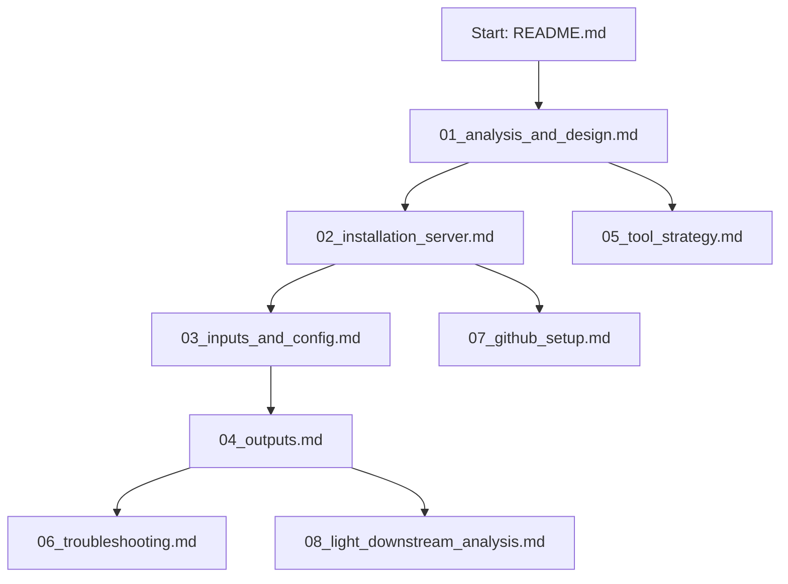

# Documentation Index

| Document | Purpose |
|---|---|
| `01_analysis_and_design.md` | Legacy-script analysis, method-review synthesis, and workflow architecture. |
| `02_installation_server.md` | Shared Linux server setup, conda installation, permissions, and resource profiles. |
| `03_inputs_and_config.md` | Sample sheet columns and config values. |
| `04_outputs.md` | Expected output tree and primary files. |
| `05_tool_strategy.md` | Functionality and software strategy. |
| `06_troubleshooting.md` | Common failure modes and fixes. |
| `07_github_setup.md` | GitHub repository creation and upload instructions. |
| `08_light_downstream_analysis.md` | Default light downstream analysis, TAD calls, compartments, outputs, and interpretation. |
